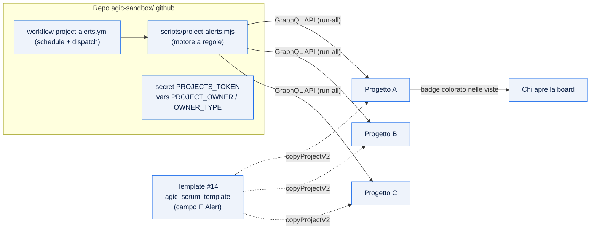

# 04 — Project Alerts (automazione allarmi)

Sistema di **allarmi/alert** per i GitHub Projects dell'organizzazione `agic-sandbox`.
Un campo single-select **🚨 Alert** viene aggiornato automaticamente da una GitHub Action
in base a 8 regole: gli item che richiedono attenzione risaltano con un badge colorato in
tutte le viste, senza intervento manuale.

> In breve: il campo Alert e nel **template** (quindi ereditato dai nuovi progetti);
> un workflow schedulato nel repo `.github` scopre **tutti** i progetti dell'org e
> aggiorna il valore del campo su ogni item.

## Architettura



## Le 8 regole

Le regole sono valutate in ordine di priorita: la **prima che fa match vince** (ogni item
riceve al massimo un alert, quello piu importante). Gli item in stato chiuso (`Done`,
`Removed`) non ricevono alert.

| # | Alert | Colore | Condizione | Soglia (default) |
|---|-------|--------|-----------|------------------|
| 1 | 🔴 Scaduto | rosso | Item aperto con `Target date` < oggi | — |
| 2 | 🔴 Bug critico aperto | rosso | Tipo Bug + `Severity` critica + stato non iniziato | Severity in Critical/High/Blocker |
| 3 | 🔴 Impediment bloccante | rosso | Tipo Impediment aperto da troppo tempo | > 3 giorni |
| 4 | 🟠 In scadenza | arancio | `Target date` entro pochi giorni | <= 3 giorni |
| 5 | 🟠 Fermo | arancio | Stato In Progress senza aggiornamenti | > 5 giorni |
| 6 | 🟠 Priorita alta in backlog | arancio | `Priority` alta + stato backlog da troppo tempo | > 5 giorni |
| 7 | 🟡 Non pronto per sprint | giallo | Item nello sprint corrente senza Story Points o senza assegnatario | — |
| 8 | 🟡 Avanzamento insufficiente | giallo | Epic/Feature nello sprint, a sprint quasi concluso, con sub-issue completate sotto soglia | sprint > 70% trascorso, progresso < 50% |

> L'ordine in tabella riflette la priorita usata dal motore (1 = piu alta).

## Il campo 🚨 Alert

Campo single-select con 8 opzioni colorate (3 rosse, 3 arancioni, 2 gialle), create via API
sul template #14. I progetti generati dal template lo ereditano automaticamente.

## Automazione

- **File**: `.github/workflows/project-alerts.yml` + `scripts/project-alerts.mjs` (Node 20, zero dipendenze).
- **Schedule**: ogni giorno alle 06:00 e 12:00 UTC.
- **Modalita** (sottocomandi dello script):
  - `run-all` — scopre tutti i progetti aperti dell'org e aggiorna quelli col campo Alert (modalita di default del workflow).
  - `run` — un solo progetto (richiede `PROJECT_NUMBER`).
  - `setup` — crea il campo Alert su un progetto (usato una-tantum sul template).
  - opzione `--dry-run` — simula senza scrivere.
- **Esecuzione manuale**: GitHub → Actions → *Project Alerts* → *Run workflow* (con scelta `mode` e `dry_run`).

## Credenziali

Il workflow usa il secret **`PROJECTS_TOKEN`**: un **PAT classico** con scope `project` + `read:org`.

| Domanda | Risposta |
|---------|----------|
| Perche non il `GITHUB_TOKEN` di default? | Non puo scrivere i Project a livello di organizzazione. |
| Perche un PAT dedicato e non un token admin personale? | Privilegio minimo: solo `project`, evita di esporre scope `admin:org` in un repo condiviso. |
| Perche non una GitHub App? | Sarebbe l'opzione piu robusta (identita macchina), ma richiede setup aggiuntivo; scartata per semplicita. Resta l'evoluzione consigliata. |

Variabili del repo: `PROJECT_OWNER` (= `agic-sandbox`), `OWNER_TYPE` (= `organization`).

## Viste

Le viste si configurano **solo da UI** (l'API GitHub non espone mutation per crearle o
modificarle). Create sul template, vengono **ereditate** dai nuovi progetti.

**Vista "🚨 Alert attivi"** (consigliata):
1. `+ New view` → rinomina in `🚨 Alert attivi`
2. Filtro: `-no:"🚨 Alert"` (mostra solo item con un alert attivo)
3. Menu `⋯` → *Save changes*

Per mostrare il campo in una vista esistente: menu `⋯` della vista → *Fields* → attiva `🚨 Alert`.

Varianti utili:
- **Board per gravita**: layout Board con *Group by → 🚨 Alert* (colonne 🔴/🟠/🟡).
- **Solo critici**: filtro `🚨 Alert:"🔴 Scaduto","🔴 Bug critico aperto","🔴 Impediment bloccante"`.

## Applicare gli alert a un progetto

- **Progetto creato dal template**: nessuna azione. Eredita campo e viste; al successivo giro
  schedulato il workflow lo processa in automatico.
- **Progetto esistente non derivato dal template**: eseguire una-tantum il setup del campo:
  ```
  PROJECT_OWNER=agic-sandbox PROJECT_NUMBER=<n> node scripts/project-alerts.mjs setup
  ```
  poi ricreare le viste in UI.

`setup` inoltre inserisce/aggiorna nel **README del progetto** una sezione **⚙️ Automazioni & impostazioni**
che riassume Alert, Digest e Velocity con i link alle guide, cosi chi lavora sul progetto sa da dove
arrivano badge, status update e velocity. Il README segue il flusso *info progetto → 📈 Velocity → ⚙️ impostazioni*.
L'operazione e idempotente e preserva il resto del README. Dettaglio digest/metriche: [guida 05](05-automazioni-processo.md).

## Configurazione delle regole

Soglie, stati, valori e mappatura tipi sono nel blocco `CONFIG` in cima a
`scripts/project-alerts.mjs`:

- soglie temporali (`dueSoonDays`, `staleDays`, `impedimentMaxAgeDays`, `highPriorityBacklogDays`, ...);
- stati: `notStartedStatuses`, `inProgressStatuses`, `doneStatuses`;
- valori `highPriorityValues` (Priority) e `criticalSeverityValues` (Severity);
- mappatura tipi `bugTypes`, `impedimentTypes`, `parentTypes` (letti da Issue Type nativo, in fallback dalle label).

Adattare questi valori a quelli effettivamente configurati sui progetti.

## Manutenzione e limiti noti

- **Rotazione token**: se il PAT scade/cambia, aggiornare il secret `PROJECTS_TOKEN`.
- **Valori dei campi**: sul template `Priority`/`Severity`/`Effort` possono risultare vuoti via
  API finche non configurati sul progetto reale; allineare `CONFIG` ai valori usati.
- **Limiti API GitHub**:
  - le viste (creazione, filtri, campi visibili) sono gestibili **solo da UI**;
  - il `GITHUB_TOKEN` di default **non** scrive i Project di organizzazione;
  - le modifiche al template **non** si propagano ai progetti gia creati (la copia e una-tantum).

## File di riferimento

| File | Ruolo |
|------|-------|
| `scripts/project-alerts.mjs` | Motore a regole (setup / run / run-all) |
| `.github/workflows/project-alerts.yml` | Schedulazione ed esecuzione |
