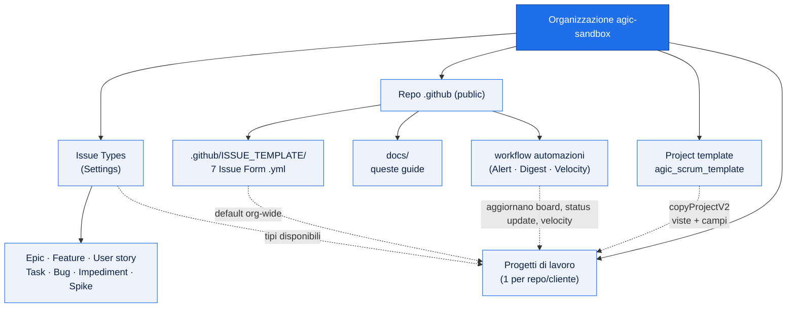

# Processi GitHub — agic-sandbox

Documentazione operativa per gestire **progetti, template e issue** nell'organizzazione
`agic-sandbox` su GitHub, in modo coerente con il modello Scrum gia in uso su Azure DevOps.

## Indice

| Guida | Argomento |
|-------|-----------|
| [01 — Issue Types e Template](01-issue-types-e-template.md) | Tipi di issue org-level, Issue Form, repo `.github` |
| [02 — Creazione progetti da template](02-creazione-progetti-da-template.md) | Clonare il template Scrum, agganciare repo, script |
| [03 — Viste, filtri e Scrum](03-viste-filtri-scrum.md) | Backlog, sprint, gerarchia, iteration, filtri per tipo |
| [04 — Project Alerts (automazione)](04-project-alerts.md) | Campo Alert, 8 regole, workflow run-all, viste filtrate |
| [05 — Automazioni di processo](05-automazioni-processo.md) | Digest settimanale (status update), metriche/velocity, Insights |

## Architettura in breve

> La copia del template (`copyProjectV2`) e i default della repo `.github` sono **una-tantum
> alla creazione** del progetto: vedi i limiti nella tabella sotto.

## Concetti chiave (e i loro limiti)

| Concetto | Come funziona | Limite da ricordare |
|----------|---------------|---------------------|
| **Issue Types** | Definiti a livello org, condivisi da tutte le repo | — |
| **Issue Template** | Default org nella repo `.github` (deve essere **public**) | Una repo con propria cartella `ISSUE_TEMPLATE` fa override |
| **Project template** | Clonato alla creazione (viste/campi inclusi) | E una **copia**: modifiche al template NON si propagano ai progetti gia creati |
| **Viste / filtri** | Configurabili solo da UI | **Non scrivibili via API** |
| **Campi custom** | Creabili/valorizzabili via API | Le viste no |
| **Project Alerts** | Workflow schedulato nel repo `.github` aggiorna il campo 🚨 Alert via API | Richiede il secret `PROJECTS_TOKEN` (PAT con scope `project`) |
| **Digest / Metriche** | Workflow schedulati pubblicano status update e velocity (README + CSV) | Status update non eseguibili sui Project template |

## Per iniziare

- Creare un nuovo progetto di lavoro → vedi [Guida 02](02-creazione-progetti-da-template.md)
- Capire i tipi di issue e i form → vedi [Guida 01](01-issue-types-e-template.md)
- Configurare board, sprint e gerarchia → vedi [Guida 03](03-viste-filtri-scrum.md)
- Capire gli alert automatici sugli item → vedi [Guida 04](04-project-alerts.md)
- Digest settimanale e metriche di velocity → vedi [Guida 05](05-automazioni-processo.md)

